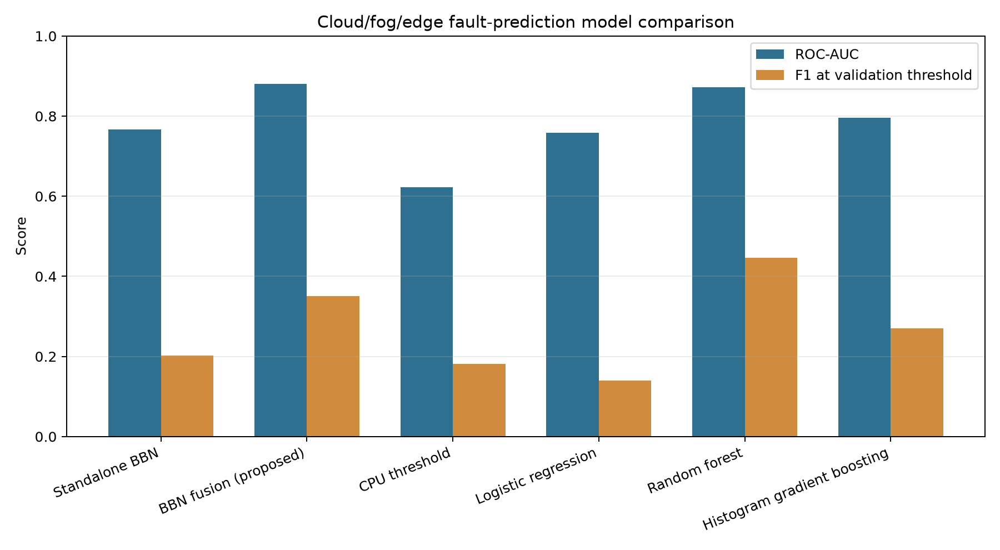
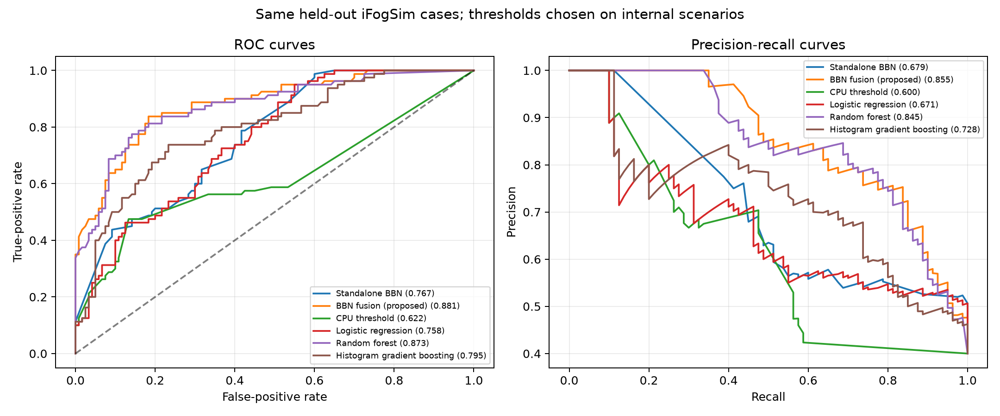

# FogComputing

## Complete project guide

This repository implements a proactive fog-node fault-prediction study using
[iFogSim](https://github.com/Cloudslab/iFogSim), a three-tier cloud/fog/edge
simulation, a Bayesian Belief Network (BBN), and comparison models.

The project is designed around this architecture:

```text
IoT sensors and user-facing edge devices
                    |
                    v
             Fog nodes
       resource-constrained nodes
                    |
                    v
                 Cloud
```

The central research question is:

> Can a model estimate the probability that a fog-computing node will fail within
a look-ahead horizon early enough for proactive migration, replication, or
placement decisions?

The current implementation generates telemetry from iFogSim, injects a separate
seeded fault process because iFogSim has no native failure model, trains the BBN
on the resulting labelled telemetry, compares it with classical models, and
reports discrimination, calibration, missing-evidence robustness, and lead time.

---

## 1. Important scope and terminology

### 1.1 Three simulated tiers

The custom simulation extension creates exactly three device classes:

| Level | Project term | Meaning | CSV value |
|---:|---|---|---|
| 0 | Cloud | Cloud/data-centre hardware | `cloud` |
| 1 | Fog | Resource-constrained fog nodes based on the Melbourne resource records | `fog` |
| 2 | Edge | User-facing or battery-powered edge devices | `edge` |

The custom extension does **not** instantiate proxy devices. The upstream iFogSim
checkout still contains its original example applications and library code, some
of which use names such as proxy, gateway, or mobile. Those upstream examples are
not the entry point for this project and are not the source of the generated
`data/raw` files.

### 1.2 What is generated by iFogSim and what is injected

The telemetry measurements are generated by live iFogSim/CloudSim state:

- CPU execution and utilisation;
- RAM allocation;
- queue/backlog state;
- uplink latency and bytes;
- tuple arrival timing used for jitter;
- mobility handovers;
- cumulative energy consumption;
- node identity, tier, and simulation time.

The following are **not native iFogSim failure outputs**:

- `ground_truth_fail`;
- `failure_time`;
- the MTBF/reliability prior;
- the energy budget used to normalise iFogSim's cumulative energy value.

`FaultInjector.java` is a separate seeded proportional-hazards failure process.
It uses the iFogSim measurements as stress inputs and creates the target label.
This separation is deliberate: the BBN is evaluated against a continuous hazard
model with a different functional form, rather than being tested against its own
CPT-generating assumptions.

### 1.3 Current measured dataset

The current regenerated dataset contains:

```text
Raw simulator rows:       89,475
Training-pool rows:       50,991
Held-out-pool rows:       38,484
Sampled training rows:     2,000
Evaluation cases:            200
Positive evaluation cases:    80
```

The raw class totals are:

```text
cloud: 612 rows
fog:   66,350 rows
edge:  22,513 rows
```

The 200 evaluation cases are intentionally balanced to 40% positives. That is
useful for a small simulation-study test set, but it is not a natural deployment
incident rate. A real deployment would require calibration or prior correction
for its actual failure prevalence.

---

## 2. Repository layout

The project root is `/Users/mohitreddy/Desktop/solution` in the current
workspace. Use relative paths from the repository root in scripts and documents.

```text
solution/
├── README.md                         this complete guide
├── DATA_GUIDE.md                     detailed data-file guide
├── run_all.sh                        end-to-end pipeline runner
├── .gitignore                         local/build exclusions
│
├── ifogsim/                          simulator and Java telemetry extension
│   ├── build.sh                      compile custom Java extension
│   ├── run_sweep.sh                  run one or all 12 scenarios
│   ├── dataset/                      iFogSim input topology and mobility files
│   ├── jars/                         Java dependencies
│   └── src/
│       ├── upstream iFogSim source   CloudSim/iFogSim implementation
│       └── org/fog/ft/                custom project extension
│
├── data/                             simulator output and BBN parameters
│   ├── raw/scenario_00..11.csv       raw labelled telemetry
│   ├── telemetry_train_pool.csv     complete training-scenario pool
│   ├── telemetry_cases_pool.csv     complete held-out-scenario pool
│   ├── telemetry_train.csv          2,000-row comparison/baseline sample
│   ├── telemetry_cases.csv          200 final evaluation cases
│   ├── discretisation_quantiles.json continuous-to-ordinal cut points
│   ├── dataset_manifest.json        split, counts, and channel audit
│   └── cpts_trained.json            learned BBN CPTs
│
└── model/                            Python BBN and comparison models
    ├── .venv/                        local Python environment, ignored by Git
    ├── requirements.txt              Python dependencies
    ├── setup_venv.sh                 create/install the environment
    ├── bbn_model.py                  BBN variables, graph, validation
    ├── cpt_tables.py                 elicited CPT generation
    ├── inference.py                  exact inference engine
    ├── discretise.py                 telemetry encoding and missing evidence
    ├── build_dataset.py              raw merge, split, quantiles, sampling
    ├── train_bbn.py                  weighted EM training
    ├── predict.py                    write per-case BBN posteriors
    ├── score_one.py                  interactive one-node scorer
    ├── verify.py                     metrics, plots, robustness, report
    ├── crosscheck_pgmpy.py           independent inference cross-check
    ├── test_inference.py             29 inference/encoding tests
    ├── MODEL_IMPROVEMENTS.md         BBN improvement experiments and rationale
    ├── experiment_improvements.py   improvement experiment runner
    ├── validate_improvements.py      scenario-fold improvement validation
    ├── tune_weighted_em.py           weighted-EM sensitivity sweep
    ├── results/                      BBN predictions, report, and plots
    └── comparison/                   alternative-model comparison suite
        ├── README.md
        ├── run_comparison.py
        ├── models/
        │   ├── threshold_model.py
        │   └── classical_models.py
        └── results/
            ├── model_comparison.csv
            ├── model_comparison.md
            ├── comparison_metrics.png
            └── comparison_roc_pr.png
```

### 2.1 What is custom and what is upstream?

The project-authored simulator code is the package:

```text
ifogsim/src/org/fog/ft/
```

The rest of `ifogsim/src/` is the iFogSim/CloudSim checkout used as the
simulation engine. The project does not patch the upstream simulator classes to
collect telemetry. Instead, it subclasses or calls them from `org.fog.ft`.

The project-authored Python code is under:

```text
model/
model/comparison/
```

Generated data is under `data/`; generated reports and diagrams are under
`model/results/` and `model/comparison/results/`. The proposed BBN is the causal-BBN
fusion model described in `model/comparison/models/bbn_fusion.py`; the standalone
causal BBN remains available as an explicit baseline.

---

## 3. End-to-end data flow

```text
1. ScenarioSweep.java
   selects one deterministic cloud/fog/edge configuration
                         |
                         v
2. MelbCBDFaultToleranceSim.java
   builds CloudSim/iFogSim entities, application, topology, mobility, placement
                         |
                         v
3. InstrumentedFogDevice.java
   observes live FogDevice state at resource-management epochs
                         |
                         v
4. NodeTelemetry.java
   represents one node/time snapshot
                         |
                         v
5. TelemetryCollector.java + FaultInjector.java
   store the snapshot, sample failure state, apply look-ahead labels
                         |
                         v
6. data/raw/scenario_NN.csv
   one complete labelled simulation output
                         |
                         v
7. build_dataset.py
   merges, audits, splits by scenario, computes cut points, samples cases
                         |
                         v
8. train_bbn.py
   converts evidence, applies weights, runs EM, writes cpts_trained.json
                         |
                         v
9. predict.py / verify.py
   posterior predictions, metrics, robustness, plots, report
                         |
                         v
10. comparison/run_comparison.py
    BBN vs threshold/logistic/random forest/gradient boosting
```

There are two independent phases:

- **Simulation phase:** Java/iFogSim creates raw observations.
- **Learning phase:** Python reorganises those observations and estimates model
  parameters.

The Python phase does not invent CPU, RAM, queue, latency, or energy measurements.

---

## 4. Simulator execution

### 4.1 Prerequisites

Required:

- Java/JDK with `javac` and `java`;
- the iFogSim source, jars, and dataset under `ifogsim/`;
- Python 3 for the model phase;
- enough disk space for the repository, generated data, and Python environment.

The Java code is compiled without Maven or Gradle. The build uses the jars stored
inside `ifogsim/jars/`.

### 4.2 Compile iFogSim extension

From the repository root:

```bash
cd ifogsim
bash build.sh
```

`build.sh` performs:

```bash
javac -nowarn \
  -cp "jars/*:jars/commons-math3-3.5/*" \
  -sourcepath src \
  -d build/classes \
  src/org/fog/ft/*.java
```

Important paths:

- source tree: `ifogsim/src`;
- custom source: `ifogsim/src/org/fog/ft`;
- compiled classes: `ifogsim/build/classes`;
- Java dependencies: `ifogsim/jars`.

`build/` is ignored because it is reproducible output.

### 4.3 Run one scenario

From `ifogsim/`:

```bash
java -cp "build/classes:jars/*:jars/commons-math3-3.5/*" \
  org.fog.ft.ScenarioSweep \
  0 \
  20260912 \
  ../data/raw/scenario_00.csv
```

Arguments:

```text
argument 1: scenario index
argument 2: simulation seed
argument 3: output CSV path
```

List all scenario definitions:

```bash
java -cp "build/classes:jars/*:jars/commons-math3-3.5/*" \
  org.fog.ft.ScenarioSweep --list
```

### 4.4 Run the sweep

```bash
cd ifogsim
bash run_sweep.sh
```

Run selected scenarios only:

```bash
bash run_sweep.sh 0 3 7
```

Use a different simulation seed:

```bash
SWEEP_SEED=12345 bash run_sweep.sh
```

The default sweep runs all 12 scenarios and writes:

```text
data/raw/scenario_00.csv
...
data/raw/scenario_11.csv
```

The script starts one JVM per scenario. This is intentional because CloudSim and
iFogSim keep simulation state in static structures, and the iFogSim controller
can call `System.exit(0)` when stopping the simulation. Separate JVMs avoid
cross-scenario state contamination.

The simulator's `DataParser` resolves `./dataset/...` relative to the current
working directory, so run the script from `ifogsim/`. `run_sweep.sh` changes to
its own directory automatically.

### 4.5 Scenario configurations

`ScenarioSweep.java` defines 12 deterministic operating regimes:

| ID | Label | Main stress variation |
|---:|---|---|
| 0 | `baseline` | standard cloud/fog/edge capacities and workload |
| 1 | `idle-fleet` | fewer edge devices and slower sensor emission |
| 2 | `chatty-sensors` | more sensors per edge device |
| 3 | `thin-fog` | reduced fog capacity and wider fog power range |
| 4 | `starved-fog` | strongly reduced fog capacity |
| 5 | `fat-fog` | increased fog capacity and workload |
| 6 | `weak-edge` | reduced edge capacity and hotter edge power model |
| 7 | `dense-edge` | more edge devices |
| 8 | `slow-backhaul` | higher fog uplink latency and lower bandwidth |
| 9 | `fog-heavy` | increased fog-facing workload |
| 10 | `edge-heavy` | larger client workload and hotter edge power model |
| 11 | `saturated` | bounded high-load stress scenario |

Each scenario modifies iFogSim inputs before the simulation runs. It does not
post-process the resulting telemetry with synthetic noise.

---

## 5. Custom Java files: complete guide

All custom Java classes use package `org.fog.ft`.

### 5.1 `ScenarioSweep.java`

Path:

```text
ifogsim/src/org/fog/ft/ScenarioSweep.java
```

Purpose:

- defines the 12 scenarios;
- exposes the `--list` command;
- parses the scenario index, seed, and output path;
- calls `MelbCBDFaultToleranceSim.runScenario`.

Important methods:

- `all()` returns the cached list of `ScenarioSpec` objects;
- `get(index)` selects one scenario;
- `count()` returns the number of scenarios;
- `main(args)` is the Java command-line entry point.

The scenario class uses exactly three levels:

```text
0 = cloud
1 = fog
2 = edge
```

The power arrays have the form:

```text
{busy_power, idle_power}
```

The simulation time is currently defined as `5000` simulation units for the
scenario sweep.

### 5.2 `ScenarioSpec.java`

Path:

```text
ifogsim/src/org/fog/ft/ScenarioSpec.java
```

Purpose:

- stores one scenario's configuration;
- maps tier level to MIPS, RAM, power, and energy budget;
- formats a human-readable scenario summary.

Important fields:

```text
cloudMips, cloudRam
fogMips, fogRam
edgeMips, edgeRam
cloudPower, fogPower, edgePower
edgeCount, sensorsPerEdge, sensorInterval
clientMips, clientRam
analyserMips, analyserRam, analysisTupleMi
fogUplinkLatency, fogUplinkBw
simulationTime
```

Important methods:

- `mipsFor(level)` maps 0/1/2 to cloud/fog/edge capacity;
- `ramFor(level)` maps 0/1/2 to cloud/fog/edge RAM;
- `powerFor(level)` maps 0/1/2 to the power model;
- `energyBudgetFor(level)` creates a declared normalisation capacity for
  iFogSim's cumulative energy measurement;
- `toString()` prints scenario settings.

The energy budget is not a battery implemented by iFogSim. It is a declared
capacity used only to calculate the relative `residual_energy` feature.

### 5.3 `MelbCBDFaultToleranceSim.java`

Path:

```text
ifogsim/src/org/fog/ft/MelbCBDFaultToleranceSim.java
```

Purpose:

This is the main simulation assembly class. It creates the application, topology,
mobility, module placement, and simulation lifecycle for one scenario.

`runScenario(scenario, seed, outCsv)` performs this sequence:

1. stores the selected `ScenarioSpec`;
2. clears static device, sensor, actuator, mobility, and output state;
3. sets `Config.MAX_SIMULATION_TIME`;
4. resets `TelemetryCollector` with the seed and scenario ID;
5. initialises CloudSim;
6. creates a `FogBroker`;
7. creates the cardiac-monitoring application;
8. creates cloud, fog, and edge devices;
9. attaches mobility traces to edge devices and fog nodes;
10. marks the topology as built;
11. maps the client module to edge devices;
12. maps archival storage to the cloud;
13. invokes iFogSim `Controller` and `ModulePlacementEdgewards`;
14. installs a shutdown hook because iFogSim can exit during stop handling;
15. starts the CloudSim event loop;
16. writes the collected CSV.

Topology creation:

```text
cloud:
  created from the level-0 Melbourne resource record

fog:
  created from the selected Melbourne gateway resource records
  parent = cloud
  name = fog-<resource-id>

edge:
  created from ScenarioSpec.edgeCount
  parent = a fog node
  name = edge-<index>
```

Proxy resource records are not instantiated by this class.

Application modules:

```text
client
  receives and filters vital-sign tuples at the edge

ecg_analyser
  analyses filtered telemetry and creates an arrhythmia verdict

archival_store
  receives summaries and is mapped to the cloud
```

Application tuple path:

```text
VITALS
  → client
  → ecg_analyser
  → client
  → ALARM
```

An archival path sends summaries toward `archival_store`.

`ModulePlacementEdgewards` is the iFogSim placement policy used by the current
implementation. The project is intended to support later proactive migration and
selective replication policies; the current Java simulation primarily generates
telemetry and labels for model evaluation.

### 5.4 `InstrumentedFogDevice.java`

Path:

```text
ifogsim/src/org/fog/ft/InstrumentedFogDevice.java
```

Purpose:

Subclass of iFogSim `FogDevice` that observes simulator state without changing
upstream `FogDevice` source.

Instrumentation callbacks:

- `setParentId(parentId)` records parent changes after topology construction;
- `processTupleArrival(event)` records tuple arrival time, bytes, and workload;
- `executeTuple(event, moduleName)` records executed MI;
- `manageResources(event)` lets iFogSim update resources and energy first, then
  creates a `NodeTelemetry` snapshot.

The class maintains short histories for:

- handover rate;
- tuple arrival times;
- inter-arrival variability.

It computes measurements including:

- CPU utilisation from executed MI over the reporting window;
- RAM utilisation from the iFogSim RAM provisioner;
- queue depth from tuple queues, scheduler queues, and arrivals;
- uplink latency from configured latency and observed transmission load;
- jitter from the coefficient of variation of tuple arrival intervals;
- residual energy from iFogSim cumulative energy divided by the declared budget.

Temperature is represented as unavailable (`NaN`) because the simulation has no
thermal sensor.

### 5.5 `NodeTelemetry.java`

Path:

```text
ifogsim/src/org/fog/ft/NodeTelemetry.java
```

Purpose:

Data-transfer object representing one node at one simulation epoch.

Identity fields:

```text
scenarioId
nodeId
nodeName
level
 deviceClass
epoch
```

Telemetry fields:

```text
cpuUtil
ramUtil
queueDepth
uplinkLatency
jitterPktLoss
handoverRate
residualEnergy
temperature
reliabilityPrior
```

Label fields:

```text
groundTruthFail
failureTime
```

Important methods:

- `withScenario(id)` creates a scenario-labelled copy;
- `csvHeader()` returns the raw CSV header;
- `toCsvRow(caseId)` serialises one row;
- `optional(...)` writes blank output for unavailable optional values.

### 5.6 `TelemetryCollector.java`

Path:

```text
ifogsim/src/org/fog/ft/TelemetryCollector.java
```

Purpose:

- stores all retained snapshots for one scenario;
- advances the `FaultInjector` on each record;
- labels snapshots after the run;
- sorts output canonically;
- writes the raw CSV;
- prints level and optional-channel summaries.

It is a singleton because iFogSim callback paths do not naturally carry a collector
reference. `reset(seed, scenarioId)` must be called before each run.

`record(t)` performs:

1. pass the snapshot to `FaultInjector.stepAndSample`;
2. discard snapshots after a node has failed;
3. retain living-node snapshots.

`labelAll()` then calculates:

- `ground_truth_fail`;
- `failure_time`.

The collector sorts by node ID and epoch before writing, so event-delivery order
does not determine CSV ordering.

### 5.7 `FaultInjector.java`

Path:

```text
ifogsim/src/org/fog/ft/FaultInjector.java
```

Purpose:

Creates the ground-truth failure process used to train/evaluate the BBN.

iFogSim2 has no native failure model, so this class is part of the experiment
harness, not the upstream simulator.

Hazard equation:

```text
lambda(node, time) = base_hazard(device_class)
                     * acceleration_factor
                     * exp(stress_sensitivity * stress_exponent)
```

The stress exponent is:

```text
1.8 * cpu_util
+ 1.0 * ram_util
+ 0.8 * normalised_queue_depth
+ 0.6 * normalised_latency
+ 1.5 * energy_depletion
+ 0.7 * jitter
+ 0.4 * normalised_handovers
```

Normalisation constants include:

```text
queue saturation:    120
latency saturation:  150 ms
handover saturation:   8 per window
```

Current tier priors:

```text
cloud: reliability 0.99, MTBF 87600 hours, stress sensitivity 0.25
fog:   reliability 0.85, MTBF  8760 hours, stress sensitivity 1.00
edge:  reliability 0.70, MTBF  8760 hours, stress sensitivity 1.25
```

The `ACCELERATION_FACTOR` is `8.0`. It compresses the real-world MTBF scale so
that a usable number of failures occurs in a finite simulation. It preserves the
relative class ordering but means the generated labels are simulation-study
ground truth, not a field reliability claim.

For each node and epoch:

```text
p_fail_in_epoch = 1 - exp(-lambda * hours_per_epoch)
```

The node-specific random draw is deterministic. It hashes:

```text
simulation seed
node ID
epoch index
random stream ID
```

using a splitmix64-style mixer. This avoids dependence on CloudSim event ordering.

The BBN target is:

```text
node_failure = 1
if failure_time > current_epoch
and failure_time <= current_epoch + 200 simulation units
```

Therefore the look-ahead horizon is `200` simulation time units.

Important public methods:

- `reliabilityPriorFor(deviceClass)`;
- `mtbfHoursFor(deviceClass)`;
- `stepAndSample(telemetry, epochLength)`;
- `failureTimeOf(nodeId)`;
- `hasFailed(nodeId)`;
- `failedNodeCount()`;
- `labelFor(telemetry)`.

### 5.8 `MobilityDriver.java`

Path:

```text
ifogsim/src/org/fog/ft/MobilityDriver.java
```

Purpose:

Moves edge devices through the Melbourne mobility traces and attaches each edge
device to its nearest fog node.

Inputs:

```text
ifogsim/dataset/random_usersLocation-melbCBD_1.csv
...
ifogsim/dataset/random_usersLocation-melbCBD_5.csv
ifogsim/dataset/edgeResources-melbCBD.csv
```

At every mobility interval:

1. advance each edge device to its next trace waypoint;
2. calculate distance to each fog node;
3. select the nearest fog node;
4. update edge uplink latency;
5. call `setParentId` when the serving fog changes;
6. update child-to-latency maps.

The mobility interval is `100` simulation time units.

This produces variation in:

- `handover_rate`;
- edge-to-fog uplink latency;
- tuple routing and queue behaviour.

### 5.9 `SeededFractionalSelectivity.java`

Path:

```text
ifogsim/src/org/fog/ft/SeededFractionalSelectivity.java
```

Purpose:

Replaces unseeded random tuple selectivity with deterministic seeded selection.

For a selectivity value `s`, `canSelect()` draws from a seeded random generator
and emits a tuple when the draw is below `s`. The class also reports mean and
maximum rate through the iFogSim `SelectivityModel` interface.

It exists because an unseeded `Math.random()` decision would make repeated runs
non-reproducible even when the scenario seed was fixed.

---

## 6. Raw telemetry schema

Every `data/raw/scenario_NN.csv` contains one row per retained living-node snapshot.
The first row is the header. Shell line counts include that header; dataset counts
in `dataset_manifest.json` exclude it.

| Column | Meaning | Source/handling |
|---|---|---|
| `case_id` | row ID within one scenario CSV | assigned by collector |
| `scenario_id` | scenario index | `ScenarioSpec.id` |
| `node_id` | iFogSim entity ID | `FogDevice.getId()` |
| `node_name` | node name | `cloud`, `fog-*`, or `edge-*` |
| `level` | tier number | 0 cloud, 1 fog, 2 edge |
| `device_class` | tier name | `cloud`, `fog`, `edge` |
| `epoch` | simulation time | `CloudSim.clock()` |
| `cpu_util` | CPU work fraction | executed MI over reporting window |
| `ram_util` | allocated RAM fraction | iFogSim RAM provisioner |
| `queue_depth` | queued/pending workload | tuple queues, scheduler lists, arrivals |
| `uplink_latency` | effective uplink delay | configured latency plus load component |
| `jitter_pktloss` | tuple arrival variability | coefficient of variation; blank when unavailable |
| `handover_rate` | recent edge-to-fog parent changes | `setParentId` history |
| `residual_energy` | normalised remaining energy | iFogSim consumption vs declared budget |
| `temperature` | thermal measurement | always blank in current simulation |
| `reliability_prior` | known tier prior | declared in `FaultInjector` |
| `ground_truth_fail` | target label | failure in the next 200 time units |
| `failure_time` | absolute injected failure time | used for labels and lead-time analysis |

The BBN does not use identifiers as evidence. It uses telemetry channels and the
known tier-derived reliability prior.

---

## 7. Data files and dataset construction

The complete file-by-file data explanation is also in [`DATA_GUIDE.md`](DATA_GUIDE.md).

### 7.1 Raw scenario files

```text
data/raw/scenario_00.csv  7,343 rows
 data/raw/scenario_01.csv  6,795 rows
 data/raw/scenario_02.csv  6,962 rows
 data/raw/scenario_03.csv  7,364 rows
 data/raw/scenario_04.csv  7,497 rows
 data/raw/scenario_05.csv  7,051 rows
 data/raw/scenario_06.csv  7,142 rows
 data/raw/scenario_07.csv  9,441 rows
 data/raw/scenario_08.csv  7,251 rows
 data/raw/scenario_09.csv  7,864 rows
 data/raw/scenario_10.csv  7,133 rows
 data/raw/scenario_11.csv  7,632 rows
```

The leading space above is only visual formatting; the actual paths are
`data/raw/scenario_00.csv` through `data/raw/scenario_11.csv`.

### 7.2 `build_dataset.py`

Path:

```text
model/build_dataset.py
```

This script does not simulate. It transforms raw simulation output into dataset
views.

Processing order:

1. load all `data/raw/scenario_*.csv` files;
2. validate required columns;
3. calculate global and per-tier channel spread;
4. warn about constant or sparse channels;
5. split complete scenarios into training and held-out sets;
6. calculate quantiles using training rows only;
7. write the complete training pool;
8. write the complete held-out pool;
9. sample a smaller training view;
10. sample 200 balanced evaluation cases;
11. write the manifest.

Current scenario split:

```text
training scenarios: 0, 2, 3, 4, 5, 6, 11
held-out scenarios: 1, 7, 8, 9, 10
```

Whole scenarios are held out instead of random rows because rows from one
simulation are strongly autocorrelated. A random row split could place nearly
identical node states in both training and test sets.

The current reproducible command is:

```bash
cd model
.venv/bin/python build_dataset.py \
  --cases 200 \
  --holdout 5 \
  --seed 999
```

Important: the script's general CLI defaults were inherited from earlier runs.
The project workflow uses the explicit `--cases 200 --holdout 5 --seed 999`
command above so generated artifacts match the current manifest.

### 7.3 `telemetry_train_pool.csv`

Complete rows from training scenarios:

```text
50,991 rows
scenarios 0, 2, 3, 4, 5, 6, 11
```

The improved BBN uses this file by default.

### 7.4 `telemetry_cases_pool.csv`

Complete rows from held-out scenarios:

```text
38,484 rows
scenarios 1, 7, 8, 9, 10
```

Used for lead-time and history-based analysis, not training.

### 7.5 `telemetry_train.csv`

A 2,000-row sampled training view. It is retained for reproducing the older
baseline and for lightweight experiments. The improved BBN uses the complete
training pool instead.

### 7.6 `telemetry_cases.csv`

The final 200-case evaluation sample:

```text
200 rows
80 positives
120 negatives
```

This file is used by `predict.py`, `verify.py`, and `comparison/run_comparison.py`.

### 7.7 `discretisation_quantiles.json`

Stores the two cut points that convert continuous channels into:

```text
low, medium, high
```

Cut points are learned only from training scenarios. Missing values remain missing;
they are not mean-imputed for the BBN.

The reliability prior is not quantised from a numeric column. It is mapped directly
from the known tier:

```text
cloud → high
fog   → medium
edge  → low
```

`residual_energy` remains human-readable: high means more energy. The inversion
happens only when the value contributes to the `energy_stress`/failure CPT.

### 7.8 `dataset_manifest.json`

Audit metadata containing:

- dataset seed;
- all scenario IDs;
- training and held-out scenario IDs;
- training-pool count;
- sampled-training count;
- held-out-pool count;
- evaluation case count and positive count;
- global channel coverage and distinct-value counts;
- per-tier channel coverage;
- warnings.

Current important channel findings:

```text
cpu_util:          100% coverage, 247 distinct values
ram_util:          100% coverage, 10 distinct values
queue_depth:       100% coverage, 711 distinct values
uplink_latency:    100% coverage, 3,119 distinct values
jitter_pktloss:   ~43% coverage, 2,483 distinct values
handover_rate:     100% coverage, 6 distinct values
residual_energy:   100% coverage, 4,475 distinct values
temperature:         0% coverage, intentionally unobserved
reliability_prior: 100% coverage, 3 distinct tier values
```

### 7.9 `cpts_trained.json`

Serialized BBN conditional probability tables. It is model state, not telemetry.
It is written by `train_bbn.py` and loaded by `predict.py` and `verify.py`.

---

## 8. BBN model

### 8.1 BBN variables

The BBN has 14 variables.

Evidence roots:

```text
cpu_util
ram_util
queue_depth
uplink_latency
jitter_pktloss
handover_rate
residual_energy
temperature
```

Latent stress variables:

```text
computational_stress
network_degradation
energy_stress
thermal_stress
```

Reliability prior:

```text
reliability_prior
```

Target:

```text
node_failure ∈ {not_fail, fail}
```

All non-target variables use:

```text
{low, medium, high}
```

### 8.2 Graph structure

The graph in `bbn_model.py` is:

```text
cpu_util ───────┐
ram_util ───────┼──> computational_stress ──┐
queue_depth ────┘                           │
                                            │
uplink_latency ─┐                           │
jitter_pktloss ─┼──> network_degradation ──┤
handover_rate ───┘                           │
                                            ├──> node_failure
residual_energy ─────> energy_stress ──────┤
                                            │
temperature ────────> thermal_stress ──────┤
                                            │
reliability_prior ─────────────────────────┘
```

Explicit parent sets:

```text
computational_stress = cpu_util, ram_util, queue_depth
network_degradation = uplink_latency, jitter_pktloss, handover_rate
energy_stress       = residual_energy
thermal_stress      = temperature
node_failure        = all four latent variables + reliability_prior
```

The evidence-to-latent direction is intentionally an ordinal aggregation design.
It makes each latent variable an explainable ranked summary of indicators. The
network is not claiming that telemetry physically causes stress; it implements the
paper's specified inference graph.

### 8.3 `bbn_model.py`

Path:

```text
model/bbn_model.py
```

Defines:

- state spaces;
- variable lists;
- parent graph;
- inverted variables;
- unobservable variables;
- topological ordering;
- `BayesianNetwork` container;
- CPT validation;
- `build_network()`.

`BayesianNetwork.validate()` checks:

- every variable has a CPT;
- every parent configuration exists;
- every row has the correct width;
- no probability is negative;
- each row sums to one.

### 8.4 `cpt_tables.py`

Path:

```text
model/cpt_tables.py
```

Creates the elicited baseline CPTs.

The ranked-node method maps ordinal states to points:

```text
low    = 1/6
medium = 1/2
high   = 5/6
```

For each parent configuration:

1. compute a weighted mean of parent points;
2. place a normal distribution around that mean;
3. truncate it to `[0, 1]`;
4. integrate over low/medium/high intervals;
5. normalise the row.

Elicited aggregator weights:

```text
computational_stress:
  cpu_util       0.45
  ram_util       0.35
  queue_depth    0.20

network_degradation:
  uplink_latency 0.30
  jitter_pktloss 0.45
  handover_rate  0.25

energy_stress:
  residual_energy 1.00

thermal_stress:
  temperature     1.00
```

Target weights:

```text
computational_stress  0.30
network_degradation   0.20
energy_stress         0.25
thermal_stress        0.10
reliability_prior     0.15
```

The target maps a weighted risk score to a failure probability between the
configured base and maximum probabilities using a convex exponent.

### 8.5 `discretise.py`

Path:

```text
model/discretise.py
```

Responsibilities:

- load quantile cut points;
- choose global or tier-specific cuts;
- convert numeric values to ordinal states;
- map `cloud/fog/edge` to the reliability state;
- omit missing channels;
- report missing evidence channels.

`row_to_evidence(row, cuts)` is the main conversion function. It returns only
reported evidence. A blank or invalid value is omitted so that the inference engine
marginalises it.

The following are not directly used as BBN evidence:

```text
case_id, scenario_id, node_id, node_name, level, epoch, failure_time
```

The device class is used to derive the known reliability prior.

### 8.6 `inference.py`

Path:

```text
model/inference.py
```

Implements two inference paths:

#### Variable elimination

`variable_elimination(net, evidence, query)` is the production path.

It:

1. creates one factor from each CPT;
2. restricts factors using observed evidence;
3. multiplies factors involving an eliminated variable;
4. sums that variable out;
5. normalises the final query factor.

#### Direct enumeration

`enumerate_posterior(net, evidence, query)` directly enumerates hidden assignments
and multiplies all local probabilities. It is slower but transparent and is used
as an independent correctness oracle.

The tests assert that both methods agree.

#### Explanation

`infer(net, evidence)` returns:

- `p_fail`;
- latent posterior distributions;
- principal latent cause;
- cause strength;
- cause lift above prior;
- genuinely missing evidence channels.

Cause selection uses posterior lift above the latent prior, not merely the largest
raw posterior. This prevents unobserved thermal stress from being incorrectly
named as the cause simply because its flat prior is numerically larger than another
posterior.

### 8.7 `train_bbn.py`

Path:

```text
model/train_bbn.py
```

The BBN graph is fixed. Training estimates CPT parameters only.

Default command:

```bash
cd model
.venv/bin/python train_bbn.py
```

Default settings:

```text
training file:              ../data/telemetry_train_pool.csv
EM iterations:              12
Dirichlet concentration:     5.0
target positive fraction:   0.40
output:                     ../data/cpts_trained.json
```

Training algorithm:

1. load raw training rows;
2. convert each row to discrete evidence;
3. map `0/1` labels to `not_fail/fail`;
4. calculate class weights targeting 40% positive prevalence;
5. aggregate identical `(evidence, label)` patterns;
6. initialise from the elicited BBN;
7. run the E-step;
8. run the Dirichlet-smoothed M-step;
9. validate all CPTs;
10. print mean log-likelihood;
11. repeat for 12 iterations;
12. serialise CPTs to JSON.

E-step details:

- latent variables are not observed;
- compute latent posteriors from evidence;
- condition those assignments on the observed outcome;
- accumulate fractional counts;
- apply class sample weights.

M-step details:

```text
posterior_count = concentration * elicited_probability + expected_count
new_probability = posterior_count / sum(posterior_count)
```

The complete training pool is used, but repeated discrete evidence patterns are
aggregated so training remains efficient without changing the sufficient statistics.

Reproduce the original smaller baseline explicitly:

```bash
.venv/bin/python train_bbn.py \
  --train ../data/telemetry_train.csv \
  --iterations 8 \
  --concentration 20 \
  --target-positive-fraction 0
```

### 8.8 `predict.py`

Path:

```text
model/predict.py
```

Scores each row in `telemetry_cases.csv`.

Elicited model:

```bash
.venv/bin/python predict.py
```

Trained model:

```bash
.venv/bin/python predict.py \
  --learned ../data/cpts_trained.json \
  --out results/predictions_trained.csv
```

Each prediction row contains:

```text
case_id
node_name
device_class
epoch
p_fail
top_cause
top_cause_lift
n_evidence
marginalised
ground_truth_fail
explanation
```

### 8.9 `score_one.py`

Path:

```text
model/score_one.py
```

Scores a manually described node.

Example fog node:

```bash
cd model
.venv/bin/python score_one.py \
  --device-class fog \
  --cpu 0.93 \
  --ram 0.88 \
  --queue 40 \
  --latency 12 \
  --jitter 0.30 \
  --energy 0.95 \
  --learned ../data/cpts_trained.json \
  --show-work
```

Example edge device with only an energy reading:

```bash
.venv/bin/python score_one.py \
  --device-class edge \
  --energy 0.12 \
  --learned ../data/cpts_trained.json \
  --show-work
```

Omitted channels are marginalised rather than imputed.

---

## 9. BBN improvement methods

The complete improvement discussion is in [`model/MODEL_IMPROVEMENTS.md`](model/MODEL_IMPROVEMENTS.md).

The current improved training uses:

1. complete training pool instead of only 2,000 rows;
2. weighted EM for rare failures;
3. 40% target training prevalence to match the balanced evaluation design;
4. 12 EM iterations;
5. Dirichlet concentration 5;
6. aggregation of duplicate discretised patterns;
7. scenario-level separation;
8. training-only quantile thresholds;
9. missing-channel marginalisation.

These choices improve ranking and probability quality for this simulation study.
They do not guarantee improvement on every threshold metric or on real fog hardware.

---

## 10. Verification and reports

### 10.1 `verify.py`

Path:

```text
model/verify.py
```

It evaluates the elicited and trained BBN on `telemetry_cases.csv` and performs:

- ROC-AUC;
- PR-AUC;
- bootstrap confidence intervals;
- threshold sweep;
- best-F1 threshold;
- precision/recall/F1/confusion matrix;
- Brier score;
- expected calibration error;
- lead-time analysis over held-out node histories;
- partial-evidence ablation;
- CPU threshold baseline comparison;
- ROC, calibration, and partial-evidence plot generation;
- Markdown report generation.

Run:

```bash
cd model
.venv/bin/python verify.py
```

Outputs:

```text
model/results/verification_report.md
model/results/predictions.csv
model/results/predictions_trained.csv
model/results/roc.png
model/results/calibration.png
model/results/partial_evidence.png
```

Current standalone causal BBN verification results:

```text
ROC-AUC:       0.767
PR-AUC:        0.679
Brier score:   0.187
ECE:           0.099
Best F1:       0.684 at threshold 0.25
Mean lead:     1.47 epochs
Detected:      71/71 failing nodes in lead-time analysis
```

The proposed BBN fusion is evaluated in the comparison suite. It combines the
standalone causal posterior with a continuous telemetry risk head using a frozen
30%/70% Bayesian log-pool selected on internal scenarios only.

### 10.2 `test_inference.py`

Path:

```text
model/test_inference.py
```

The test suite currently contains 29 tests covering:

- 14-variable graph;
- acyclicity;
- paper graph edges;
- CPT shape and normalisation;
- variable elimination vs enumeration;
- posterior normalisation;
- missing evidence;
- stress monotonicity;
- healthy vs stressed nodes;
- explanation cause attribution;
- invalid variables/states/targets;
- malformed CPT detection;
- ranked-node truncated-normal behaviour;
- quantile state conversion;
- constant-channel handling;
- cloud/fog/edge reliability mapping.

Run:

```bash
cd model
.venv/bin/python -m pytest test_inference.py -q
```

Expected current result:

```text
29 passed
```

### 10.3 `crosscheck_pgmpy.py`

Path:

```text
model/crosscheck_pgmpy.py
```

Rebuilds the same graph and CPTs in pgmpy and compares selected posterior queries
with the project's own inference engine. It is an independent implementation check,
not a second trained model.

Run:

```bash
cd model
.venv/bin/python crosscheck_pgmpy.py
```

If pgmpy is unavailable, the script skips cleanly after printing that the optional
cross-check is unavailable.

---

## 11. Model comparison suite

Comparison code is deliberately separated under:

```text
model/comparison/
```

The complete comparison guide is [`model/comparison/README.md`](model/comparison/README.md).

### 11.1 `comparison/run_comparison.py`

Loads:

```text
training: data/telemetry_train_pool.csv
evaluation: data/telemetry_cases.csv
trained BBN CPTs: data/cpts_trained.json
```

It fits/evaluates:

1. BBN fusion proposed model;
2. standalone causal BBN;
3. CPU threshold;
4. logistic regression;
5. random forest;
6. histogram gradient boosting.

The classical models use an explicit feature allow-list:

```text
numeric:
  cpu_util
  ram_util
  queue_depth
  uplink_latency
  jitter_pktloss
  handover_rate
  residual_energy

categorical:
  device_class
```

They do not use:

```text
case_id
scenario_id
node_id
node_name
level
epoch
failure_time
```

Numeric preprocessing:

- training-only median imputation;
- missing indicators;
- standardisation for logistic regression;
- one-hot encoding for the three device classes.

Classical sample weights correct the natural rare-event imbalance toward the 40%
evaluation design.

The fusion weight and proposed alarm threshold are frozen from pooled out-of-fold
predictions on internal training scenarios. Classical-model F1 thresholds are also
selected on internal training scenarios. No final evaluation case is used for
selection.

### 11.2 Proposed BBN fusion

The proposed model is not the standalone three-state BBN alone. It is a Bayesian
log-pool that keeps the standalone causal BBN as the explanation and missing-data
path while adding a continuous telemetry risk head:

```text
causal BBN posterior       30% log-odds
continuous risk head       70% log-odds
                         ----------------
                         proposed BBN fusion
```

The fusion equation is:

```text
logit(P_fusion) = 0.30 * logit(P_causal_bbn)
                + 0.70 * logit(P_continuous_risk)
```

The continuous risk head uses raw telemetry with training-only imputation and
missing indicators. It excludes identifiers, scenario IDs, node IDs, epoch, and
failure time. The 30/70 weight and proposed threshold 0.63 were selected from
pooled out-of-fold predictions on internal training scenarios only. The final
200-case evaluation set was not used for selection.

The standalone causal BBN remains visible and independently reportable. This is
important: it shows exactly how much the continuous evidence-fusion component adds.
The fusion is still BBN-driven because the causal BBN supplies one probability
source, the latent-stress explanation, tier reliability prior, and missing-evidence
marginalisation.

Detailed design: [`model/results/MODEL_FUSION_NOTE.md`](model/results/MODEL_FUSION_NOTE.md).

### 11.3 Comparison outputs

```text
model/comparison/results/model_comparison.csv
model/comparison/results/model_comparison.md
model/comparison/results/comparison_metrics.png
model/comparison/results/comparison_roc_pr.png
```

### 11.4 Comparison diagrams

#### Metric comparison



#### ROC and precision-recall comparison



Current comparison metrics:

| Model | ROC-AUC | PR-AUC | Brier | ECE | F1 |
|---|---:|---:|---:|---:|---:|
| BBN fusion (proposed) | 0.881 | 0.855 | 0.181 | 0.185 | 0.351 |
| Standalone BBN | 0.767 | 0.679 | 0.187 | 0.099 | 0.202 |
| CPU threshold | 0.622 | 0.600 | N/A | N/A | 0.182 |
| Logistic regression | 0.758 | 0.671 | 0.198 | 0.118 | 0.140 |
| Random forest | 0.873 | 0.845 | 0.195 | 0.203 | 0.447 |
| Histogram gradient boosting | 0.795 | 0.728 | 0.208 | 0.178 | 0.271 |

Interpretation:

- the proposed BBN fusion has the strongest ROC-AUC and PR-AUC in this current
  held-out simulation test;
- the standalone causal BBN remains visible as the explainable baseline;
- random forest still has the highest F1 at its selected alarm threshold;
- the fusion is a Bayesian log-pool, not a claim that the standalone three-state
  BBN alone beats every discriminative model;
- BBN exposes latent causal explanations and handles missing evidence explicitly;
- CPU threshold is a simple reactive baseline, not a calibrated probability model;
- classical models are useful comparison points but do not replace the framework's
  causal, risk-aware decision layer.

Run comparison alone:

```bash
cd model
.venv/bin/python comparison/run_comparison.py
```

---

## 12. Root scripts

### 12.1 `run_all.sh`

Path:

```text
run_all.sh
```

Runs the complete pipeline:

```text
1/7 compile Java extension
2/7 generate 12 iFogSim scenarios
3/7 rebuild datasets
4/7 train weighted BBN
5/7 create elicited and trained predictions
6/7 verify BBN
7/7 compare alternative models
```

Run:

```bash
bash run_all.sh
```

The complete run can take several minutes because Java simulation scenario 11 is
the slowest workload.

### 12.2 `.gitignore`

Excludes reproducible/local files:

```text
model/.venv/
Python caches
Java build/classes
ifogsim/out
ifogsim/output
ifogsim/results
IDE files
logs and temporary files
```

Generated data, reports, diagrams, source files, and input datasets are tracked by
the current project commit.

---

## 13. Complete reproducibility commands

### 13.1 First-time Python environment

```bash
cd model
bash setup_venv.sh
```

This creates `model/.venv` and installs `requirements.txt`.

Required packages:

```text
numpy
pandas
scikit-learn
matplotlib
pytest
```

`pgmpy` is optional for the independent cross-check.

### 13.2 Full clean logical rebuild

From the repository root:

```bash
# Compile custom Java code
(cd ifogsim && bash build.sh)

# Regenerate raw iFogSim data
(cd ifogsim && bash run_sweep.sh)

# Rebuild data views and metadata
(cd model && .venv/bin/python build_dataset.py \
  --cases 200 \
  --holdout 5 \
  --seed 999)

# Train the improved BBN
(cd model && .venv/bin/python train_bbn.py)

# Generate trained predictions
(cd model && .venv/bin/python predict.py \
  --learned ../data/cpts_trained.json \
  --out results/predictions_trained.csv)

# Verify BBN
(cd model && .venv/bin/python verify.py)

# Compare alternative models
(cd model && .venv/bin/python comparison/run_comparison.py)
```

### 13.3 Fast code-only validation

This does not regenerate Java data:

```bash
cd model
.venv/bin/python -m pytest test_inference.py -q
.venv/bin/python crosscheck_pgmpy.py
.venv/bin/python verify.py
.venv/bin/python comparison/run_comparison.py
```

### 13.4 Repeat one simulation only

```bash
cd ifogsim
bash build.sh
bash run_sweep.sh 0
```

This overwrites `../data/raw/scenario_00.csv`.

---

## 14. Common troubleshooting

### `Not compiled yet. Run ./build.sh first.`

Compile from `ifogsim/`:

```bash
cd ifogsim
bash build.sh
```

### `dataset/edgeResources-melbCBD.csv` not found

Run the simulator from `ifogsim/`, not from an unrelated directory:

```bash
cd ifogsim
bash run_sweep.sh
```

### Python package import failure

Create/rebuild the local environment:

```bash
cd model
bash setup_venv.sh
```

Then use:

```bash
.venv/bin/python ...
```

Do not install into the system Python if it is externally managed by PEP 668.

### `temperature` has zero coverage

This is expected. No thermal sensor is implemented in the current iFogSim
instrumentation. The BBN keeps `temperature` and `thermal_stress` so the network
can marginalise an unavailable channel; it does not fabricate temperature values.

### `jitter_pktloss` is blank on some rows

This is expected when too few tuple arrivals exist to calculate inter-arrival
variability. The BBN omits that evidence and marginalises it.

Also note that packet loss itself is not simulated. The current field measures
arrival timing variability, not actual dropped-packet probability.

### Why does the raw row count change after failures?

`TelemetryCollector` stops retaining snapshots after a node has failed. Therefore
post-failure telemetry is not emitted as if a dead node were still reporting.
`ground_truth_fail` is assigned to retained snapshots whose future horizon contains
the failure.

### Why are classical models sometimes more accurate than the BBN?

The BBN is a fixed, explainable, causal-aggregation network with three-state
inputs and missing-evidence handling. Random forests and boosting are flexible
discriminative models that can fit complex interactions in this particular
simulation dataset. The comparison is therefore useful: predictive accuracy alone
is not the only requirement for an explainable, risk-aware migration controller.

### Why should I not use random row splits?

Rows from the same scenario/node history are correlated. Random splitting lets the
model train on near-identical observations from the same simulation regime it will
later be tested on. Scenario-level holdout is stricter and better matches the claim
that the model handles unseen operating regimes.

### Why do generated metrics change after changing the seed?

The seed controls deterministic selectivity, mobility trace offsets, and failure
randomness. A different seed defines a different simulation experiment. Keep the
default seed values when reproducing the committed metrics.

---

## 15. Research limitations and honest interpretation

1. **Failure labels are injected.** iFogSim does not provide native node failures;
   `FaultInjector` is the experiment's ground-truth generator.
2. **Temperature is unobserved.** The thermal branch is present but marginalised.
3. **Packet loss is not modelled.** Jitter is measured from tuple arrivals, not
   dropped-packet traces.
4. **Energy budget is declared.** iFogSim supplies cumulative consumption but not
   battery capacity.
5. **RAM is mostly placement-static.** It distinguishes allocation/configuration
   differences more than dynamic memory pressure.
6. **The evaluation set is small.** It contains 200 balanced cases; confidence
   intervals are therefore wide.
7. **Balanced evaluation prevalence is artificial.** Deployment calibration must
   use the real failure rate.
8. **The simulation is not field validation.** Results support the simulation
   study and implementation comparison, not a claim of real-node reliability.
9. **The proactive policy is not fully deployed in the current runner.** The
   current project predicts risk and documents the intended risk-aware migration
   and selective-replication framework. A production controller would connect
   posterior risk to migration cost, application criticality, standby capacity,
   and placement actions.

---

## 16. Recommended reading order

If you are new to the project, read in this order:

1. this README, Sections 1–4;
2. [`DATA_GUIDE.md`](DATA_GUIDE.md), for every data file;
3. `ifogsim/src/org/fog/ft/MelbCBDFaultToleranceSim.java`;
4. `ifogsim/src/org/fog/ft/InstrumentedFogDevice.java`;
5. `ifogsim/src/org/fog/ft/FaultInjector.java`;
6. `model/bbn_model.py`;
7. `model/cpt_tables.py`;
8. `model/inference.py`;
9. `model/train_bbn.py`;
10. `model/verify.py`;
11. [`model/MODEL_IMPROVEMENTS.md`](model/MODEL_IMPROVEMENTS.md);
12. [`model/comparison/README.md`](model/comparison/README.md);
13. `model/comparison/results/model_comparison.md`.

For a one-node demonstration, run `score_one.py` with `--show-work`. For the whole
experiment, run `bash run_all.sh` from the repository root.

---

## 17. Complete file index

This section lists every project-authored file outside the upstream iFogSim source.
The upstream checkout contains additional examples, utilities, tests, images, and
CloudSim classes; those are intentionally not reproduced in this index because they
are dependencies or examples rather than this project's implementation.

### Root files

| File | Purpose |
|---|---|
| `README.md` | This complete architecture, implementation, data, model, comparison, and reproduction guide |
| `DATA_GUIDE.md` | Focused explanation of every file under `data/` and its generation path |
| `run_all.sh` | Seven-stage end-to-end runner: compile, simulate, build data, train, predict, verify, compare |
| `.gitignore` | Excludes Python environments/caches, Java build output, IDE files, and upstream demo output |

### Custom Java files

| File | Main responsibility |
|---|---|
| `ifogsim/src/org/fog/ft/ScenarioSweep.java` | CLI entry point and twelve deterministic scenario definitions |
| `ifogsim/src/org/fog/ft/ScenarioSpec.java` | Configuration object for cloud/fog/edge capacity, power, workload, links, and run time |
| `ifogsim/src/org/fog/ft/MelbCBDFaultToleranceSim.java` | Creates CloudSim, application, three-tier topology, mobility, edgeward placement, and simulation lifecycle |
| `ifogsim/src/org/fog/ft/InstrumentedFogDevice.java` | `FogDevice` subclass that observes CPU, RAM, queues, arrivals, latency, energy, jitter, and handovers |
| `ifogsim/src/org/fog/ft/NodeTelemetry.java` | One node/epoch telemetry object and CSV serialisation |
| `ifogsim/src/org/fog/ft/TelemetryCollector.java` | Collects snapshots, invokes fault injection, labels rows, sorts them, and writes scenario CSVs |
| `ifogsim/src/org/fog/ft/FaultInjector.java` | Seeded proportional-hazards ground-truth failure process and look-ahead labels |
| `ifogsim/src/org/fog/ft/MobilityDriver.java` | Advances edge devices through Melbourne traces and re-associates them with nearest fog nodes |
| `ifogsim/src/org/fog/ft/SeededFractionalSelectivity.java` | Reproducible seeded implementation of iFogSim tuple selectivity |

### Java scripts and inputs

| File/folder | Purpose |
|---|---|
| `ifogsim/build.sh` | Compiles `org.fog.ft` against upstream iFogSim/CloudSim source and jars |
| `ifogsim/run_sweep.sh` | Runs selected or all twelve Java scenarios into `../data/raw/` |
| `ifogsim/dataset/edgeResources-melbCBD.csv` | Melbourne cloud/fog resource input read by `DataParser` and the custom topology builder |
| `ifogsim/dataset/random_usersLocation-melbCBD_1..5.csv` | Mobility traces assigned to edge devices |
| `ifogsim/dataset/usersLocation-melbCBD_1.csv` | Upstream mobility input retained with the iFogSim dataset |
| `ifogsim/dataset/config.properties` | Upstream dataset/configuration input |
| `ifogsim/dataset/*.PNG` | Upstream visualisations of resource and mobility data |
| `ifogsim/jars/*.jar` | Java runtime dependencies used by the manual `javac`/`java` commands |

### Core Python BBN files

| File | Main responsibility |
|---|---|
| `model/bbn_model.py` | Defines the fourteen variables, states, directed graph, CPT container, topological order, and validation |
| `model/cpt_tables.py` | Defines elicited weights and builds ranked-node/truncated-normal CPTs |
| `model/inference.py` | Implements factor operations, variable elimination, direct enumeration oracle, posterior explanation, and missing-evidence reporting |
| `model/discretise.py` | Loads cut points, maps continuous telemetry to ordinal states, maps tier to reliability prior, and omits missing evidence |
| `model/build_dataset.py` | Merges raw CSVs, audits channels, splits scenarios, computes training-only quantiles, samples views, and writes manifest |
| `model/train_bbn.py` | Loads evidence, aggregates duplicate patterns, computes class weights, runs weighted EM, smooths CPTs, and writes JSON |
| `model/predict.py` | Loads elicited or trained CPTs and writes one posterior/explanation row per evaluation case |
| `model/score_one.py` | Command-line single-node demonstration with optional explanation and marginalised channels |
| `model/verify.py` | Calculates AUC/PR-AUC, confidence intervals, threshold metrics, calibration, lead time, partial evidence, plots, and report |
| `model/crosscheck_pgmpy.py` | Rebuilds selected inference queries with pgmpy for an independent implementation check |
| `model/test_inference.py` | 29 tests for graph, CPTs, inference, explanation, monotonicity, validation, quantiles, missing values, and cloud/fog/edge priors |
| `model/requirements.txt` | Python dependency declarations: numpy, pandas, scikit-learn, matplotlib, pytest, and optional pgmpy |
| `model/setup_venv.sh` | Creates `.venv`, installs requirements, and checks core/optional imports |

### BBN improvement experiment files

| File | Main responsibility |
|---|---|
| `model/MODEL_IMPROVEMENTS.md` | Methods, leakage controls, baseline/improved results, validation, tradeoffs, and limitations |
| `model/experiment_improvements.py` | Compares sampling, class balancing, EM iterations, and Dirichlet strengths |
| `model/validate_improvements.py` | Tests candidate settings on internal scenario folds rather than selecting only on final cases |
| `model/tune_weighted_em.py` | Sensitivity analysis over target positive fraction and Dirichlet concentration |

### Comparison model files

| File | Main responsibility |
|---|---|
| `model/comparison/README.md` | Comparison-specific methodology, model definitions, fairness protocol, and commands |
| `model/comparison/run_comparison.py` | Loads the same train/case files, fits/evaluates five models, selects internal thresholds, writes metrics and figures |
| `model/comparison/models/bbn_fusion.py` | Proposed Bayesian log-pool of causal BBN posterior and continuous telemetry risk head |
| `model/comparison/models/threshold_model.py` | CPU-only threshold/ranking baseline |
| `model/comparison/models/classical_models.py` | Scikit-learn preprocessing plus logistic regression, random forest, and histogram gradient boosting |

### Generated data files

| File | Generated by | Contents/use |
|---|---|---|
| `data/raw/scenario_00..11.csv` | Java `TelemetryCollector` | Complete labelled raw output for each iFogSim scenario |
| `data/telemetry_train_pool.csv` | `build_dataset.py` | All rows from training scenarios; default BBN training input |
| `data/telemetry_cases_pool.csv` | `build_dataset.py` | All rows from held-out scenarios; lead-time/history analysis |
| `data/telemetry_train.csv` | `build_dataset.py` | 2,000-row sampled training view for comparison with the old baseline |
| `data/telemetry_cases.csv` | `build_dataset.py` | 200 balanced final evaluation cases |
| `data/discretisation_quantiles.json` | `build_dataset.py` | Training-only low/medium/high cut points |
| `data/dataset_manifest.json` | `build_dataset.py` | Seeds, scenario split, counts, channel spread, and warnings |
| `data/cpts_trained.json` | `train_bbn.py` | Learned latent and target CPT parameters |

### Generated BBN outputs

| File | Generated by | Contents |
|---|---|---|
| `model/results/predictions.csv` | `predict.py` | Elicited-model case posteriors |
| `model/results/predictions_trained.csv` | `predict.py --learned` | Trained-model case posteriors and explanations |
| `model/results/verification_report.md` | `verify.py` | Current BBN metrics, calibration, lead time, ablation, and figures |
| `model/results/roc.png` | `verify.py` | ROC curve figure |
| `model/results/calibration.png` | `verify.py` | Reliability/calibration figure |
| `model/results/partial_evidence.png` | `verify.py` | Robustness figure as channels are withheld |
| `model/results/improvement_experiments.csv` | `experiment_improvements.py` | Candidate training-configuration results |
| `model/results/improvement_validation.csv` | `validate_improvements.py` | Internal scenario-fold validation results |
| `model/results/weighted_em_tuning.csv` | `tune_weighted_em.py` | Weighted-EM target/concentration sensitivity results |
| `model/results/MODEL_FUSION_NOTE.md` | fusion implementation | Exact causal-BBN/continuous-risk fusion design and current result |
| `model/results/fusion_config.json` | internal selection script | Frozen fusion weight, threshold, and internal selection metrics |

### Generated comparison outputs

| File | Generated by | Contents |
|---|---|---|
| `model/comparison/results/model_comparison.csv` | `run_comparison.py` | Machine-readable metrics for the proposed fusion, standalone BBN, and baselines |
| `model/comparison/results/model_comparison.md` | `run_comparison.py` | Human-readable comparison report |
| `model/comparison/results/comparison_metrics.png` | `run_comparison.py` | ROC-AUC/F1 grouped bar chart |
| `model/comparison/results/comparison_roc_pr.png` | `run_comparison.py` | ROC and precision-recall curve diagram |

### Ignored local directories

| Directory | Why it is not committed |
|---|---|
| `model/.venv/` | Large machine-local Python environment; recreate with `setup_venv.sh` |
| `model/**/__pycache__/` | Python bytecode cache |
| `model/.pytest_cache/` | pytest cache |
| `ifogsim/build/` | Java compiler output; recreate with `build.sh` |
| `ifogsim/out/` | IDE/compiler output |
| `ifogsim/output/` | Upstream iFogSim demonstration binaries |
| `ifogsim/results/` | Upstream iFogSim demonstration results |
