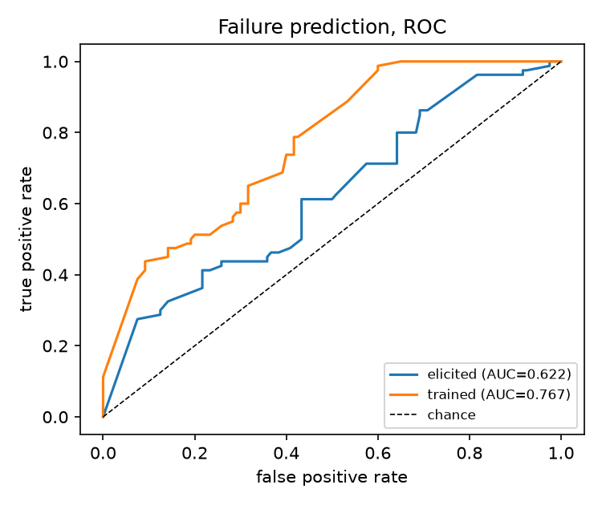
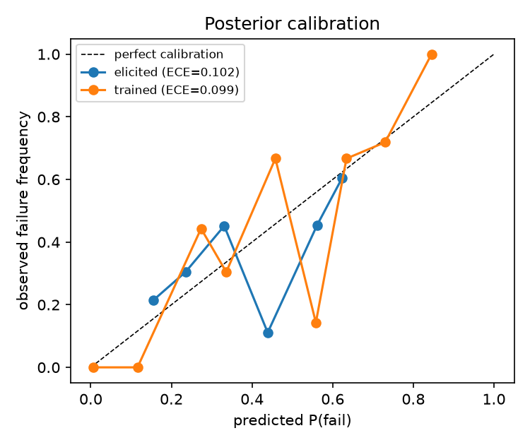
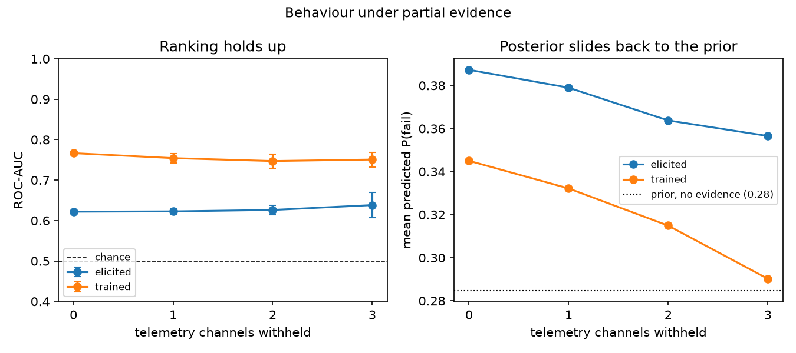

# BBN failure prediction — verification report

- Cases: `telemetry_cases.csv` — 200 cases, 80 positives (40% prevalence)
- Telemetry pool: 38484 snapshots over 199 nodes
- Training set: `telemetry_train_pool.csv` — drawn from **different scenarios** than the cases scored here, so the model is evaluated on operating regimes it never saw during training
- Look-ahead horizon Δt: 200 time units (2 epochs)

Two models are reported throughout. **Elicited** uses the conditional probability tables generated from expert weights alone, with no failure data at all — the honest starting position the paper describes, since no public failure trace exists for this topology. **Trained** learns those tables from the complete iFogSim training pool using class-weighted, Dirichlet-smoothed EM; EM is necessary because the four latent stress conditions are never observed. The network structure is the paper's Fig. 2 in both cases; only the parameters differ.

## 1. Discrimination

| model | ROC-AUC | 95% CI | PR-AUC | 95% CI |
|---|---|---|---|---|
| elicited | 0.622 | [0.538, 0.699] | 0.539 | [0.436, 0.651] |
| trained | 0.767 | [0.699, 0.825] | 0.679 | [0.583, 0.776] |

Both intervals are wide, and unavoidably so: 200 cases with 80 positives cannot resolve differences smaller than roughly 0.1 in AUC. Differences inside that band should not be read as real.

## 2. Classification quality

**elicited**, threshold sweep:

| threshold | TP | FP | TN | FN | precision | recall | F1 | accuracy |
|---|---|---|---|---|---|---|---|---|
| 0.10 | 80 | 120 | 0 | 0 | 0.400 | 1.000 | 0.571 | 0.400 |
| 0.20 | 77 | 109 | 11 | 3 | 0.414 | 0.963 | 0.579 | 0.440 |
| 0.30 | 63 | 77 | 43 | 17 | 0.450 | 0.787 | 0.573 | 0.530 |
| 0.40 | 35 | 43 | 77 | 45 | 0.449 | 0.438 | 0.443 | 0.560 |
| 0.50 | 33 | 27 | 93 | 47 | 0.550 | 0.412 | 0.471 | 0.630 |
| 0.60 | 23 | 15 | 105 | 57 | 0.605 | 0.287 | 0.390 | 0.640 |
| 0.70 | 0 | 0 | 120 | 80 | 0.000 | 0.000 | 0.000 | 0.600 |

Best F1 0.604 at threshold 0.23.

**trained**, threshold sweep:

| threshold | TP | FP | TN | FN | precision | recall | F1 | accuracy |
|---|---|---|---|---|---|---|---|---|
| 0.10 | 80 | 80 | 40 | 0 | 0.500 | 1.000 | 0.667 | 0.600 |
| 0.20 | 80 | 78 | 42 | 0 | 0.506 | 1.000 | 0.672 | 0.610 |
| 0.30 | 45 | 34 | 86 | 35 | 0.570 | 0.562 | 0.566 | 0.655 |
| 0.40 | 38 | 18 | 102 | 42 | 0.679 | 0.475 | 0.559 | 0.700 |
| 0.50 | 36 | 17 | 103 | 44 | 0.679 | 0.450 | 0.541 | 0.695 |
| 0.60 | 35 | 11 | 109 | 45 | 0.761 | 0.438 | 0.556 | 0.720 |
| 0.70 | 31 | 9 | 111 | 49 | 0.775 | 0.388 | 0.517 | 0.710 |

Best F1 0.684 at threshold 0.25.

## 3. Calibration

| model | Brier | ECE |
|---|---|---|
| elicited | 0.2340 | 0.1023 |
| trained | 0.1872 | 0.0995 |

Calibration is what separates a posterior usable in an expected-loss migration rule from a score that merely ranks. The rule `migrate iff P(fail)·C_fail > C_migrate` is only meaningful if P(fail) is a probability rather than an ordering.

## 4. Lead time

| model | failing nodes | detected | detection rate | mean lead | median lead | mean lead (epochs) |
|---|---|---|---|---|---|---|
| elicited | 71 | 69 | 0.97 | 147.8 | 144.6 | 1.48 |
| trained | 71 | 71 | 1.00 | 146.5 | 144.4 | 1.47 |

Lead time is measured only inside the Δt window before each failure, so an alarm raised earlier than that earns no credit. A migration needs less than one epoch to complete, so any mean lead above 1.0 epochs leaves room to act.

## 5. Robustness to partial evidence

| model | channels withheld | ROC-AUC | s.d. | F1 | mean P(fail) | predictions made |
|---|---|---|---|---|---|---|
| elicited | 0 | 0.622 | 0.000 | 0.604 | 0.387 | 200 |
| elicited | 1 | 0.623 | 0.007 | 0.598 | 0.379 | 200 |
| elicited | 2 | 0.626 | 0.012 | 0.598 | 0.364 | 200 |
| elicited | 3 | 0.638 | 0.031 | 0.594 | 0.357 | 200 |
| trained | 0 | 0.767 | 0.000 | 0.684 | 0.345 | 200 |
| trained | 1 | 0.754 | 0.012 | 0.674 | 0.332 | 200 |
| trained | 2 | 0.747 | 0.017 | 0.664 | 0.315 | 200 |
| trained | 3 | 0.751 | 0.018 | 0.667 | 0.290 | 200 |

Same ablation applied to the threshold baseline:

| rule | channels withheld | F1 | alarms raised | predictions made |
|---|---|---|---|---|
| threshold on CPU | 0 | 0.182 | 8.0 | 200.0 |
| threshold on CPU | 1 | 0.139 | 6.1 | 153.3 |
| threshold on CPU | 2 | 0.145 | 6.4 | 160.0 |
| threshold on CPU | 3 | 0.109 | 4.8 | 120.0 |

Two things are worth reading carefully here, and one of them is not the result that was expected.

Discrimination barely moves. Withholding three of the seven observable channels leaves the BBN's ROC-AUC essentially where it started, rather than degrading it. That is a property of this telemetry, not a triumph of the model: the channels are largely redundant, because the same underlying degradation drives utilisation, queueing, jitter and energy together, so any surviving subset still carries most of the signal. What does move, and in the direction the theory predicts, is the sharpness of the posterior — the mean P(fail) slides steadily back toward the prior as evidence is removed, which is the model correctly becoming less certain rather than less correct.

The structural difference is in the last column of each table. The BBN returns a posterior for all 200 cases no matter which channels are dark, because the missing variables are marginalised out by Eq. (1) rather than imputed. The threshold rule cannot: in the trials where CPU utilisation is the withheld channel it has nothing to compare against, raises no alarm at all, and every failing node passes unflagged. That is the difference between an answer with wider error bars and no answer, and it is the reason the paper argues for a probabilistic model over a fixed threshold.

## 6. Comparison with a threshold baseline

Single-metric rule, CPU utilisation ≥ 0.30, tuned to its own best F1 on these same cases:

| rule | ROC-AUC | precision | recall | F1 | accuracy |
|---|---|---|---|---|---|
| threshold on CPU (FTAPA-style) | 0.622 | 1.000 | 0.100 | 0.182 | 0.640 |
| BBN (elicited) | 0.622 | 0.440 | 0.963 | 0.604 | 0.495 |
| BBN (trained) | 0.767 | 0.523 | 0.988 | 0.684 | 0.635 |

The baseline is given every advantage here. Its cut is tuned on the very cases it is scored on, which the BBN's elicited tables never saw, and CPU utilisation reports on every case in this set, so its structural weakness under missing telemetry costs it nothing. On those terms it is competitive: its AUC sits inside the refined model's confidence interval, and this evaluation set is too small to separate them. The honest summary is that with complete telemetry and a threshold tuned on the test data, the single metric rule does well — and that the case for the BBN rests on the calibrated posterior of Section 3, which a threshold does not produce at all, and on the behaviour under missing telemetry in Section 5.

## Figures





## Reproducing this

```
bash run_all.sh
```

The simulator seed and dataset seed are fixed. The final fit uses the complete training pool with class-weighted EM; no held-out scenario is used for training.
